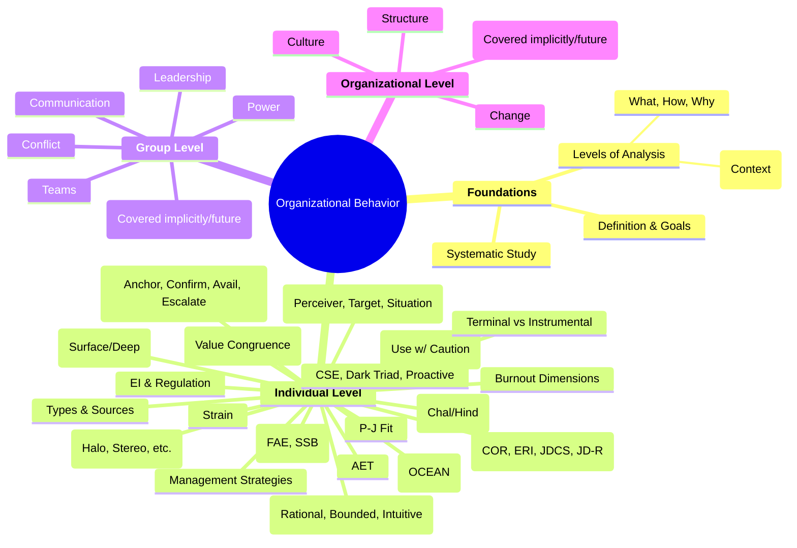

Okay, absolutely! Based on the PPTs and our discussions covering Classes 1 through 7, here is a structured outline of the key concepts, models, and frameworks. I've tried to organize it logically to help you identify the right theoretical tools and use precise OB language for your group project.

This outline emphasizes the "building blocks" of OB understanding, moving from foundational concepts to individual processes and finally stress/well-being, which integrates many previous ideas.

**I. Foundational Concepts & Frameworks (Classes 1 & 2)**

*   **A. Defining Organizational Behavior (OB)**
    *   **Definition:** Study of individual, group, and structural impacts on behavior within organizations to improve effectiveness.
    *   **Goals of OB:** Explanation, Prediction, Influence/Control.
    *   **Importance:** Understanding workplace dynamics, improving management, enhancing personal effectiveness.
*   **B. Management Fundamentals**
    *   **Management Functions (POLC):** Planning, Organizing, Leading, Controlling.
    *   **Management Skills:** Technical, Human (critical for OB), Conceptual.
*   **C. OB as a Science**
    *   **Systematic Study:** Emphasizes evidence-based approach over intuition.
    *   **Basic OB Model:** Inputs -> Processes -> Outcomes (at Individual, Group, Org Levels).
        *   **Independent Variables (IVs):** Presumed causes (e.g., personality, leadership style).
        *   **Dependent Variables (DVs):** Key outcomes OB seeks to explain/predict:
            *   *Performance/Productivity:* Effectiveness & Efficiency.
            *   *Attitudes:* Job Satisfaction, Organizational Commitment.
            *   *Behaviors:* Organizational Citizenship Behavior (OCB), Withdrawal (Absenteeism, Turnover), Counterproductive Work Behaviors (CWB - implied).
*   **D. Building & Evaluating OB Theory (Whetten, 1989)**
    *   **Model:** Abstraction/simplification of reality.
    *   **Essential Elements of a Theory:**
        *   **What:** Key factors, variables, constructs. (Comprehensiveness vs. Parsimony).
        *   **How:** Relationships between factors (causality, correlations +/-).
        *   **Why:** Underlying logic, mechanisms, theoretical explanation.
        *   **Who, Where, When:** Boundary conditions, context, generalizability.
    *   **Theory Development:** Contribution through altering/refining these elements.
*   **E. Importance of Context (Whetten, 2008)**
    *   **Context Sensitivity:** Need to consider situational factors.
    *   **Contextualizing Theory:** Applying general theory to specific context ("Looking through the lens").
    *   **Theorizing Context:** Developing general theory from context ("Improving the lens").
*   **F. Levels of Analysis (Rousseau, 1985)**
    *   **Individual Level (Micro):** Personality, Perception, Motivation, Emotions, Decision Making, Stress.
    *   **Group Level (Meso):** Team Dynamics, Communication, Leadership (dyadic/group), Power, Conflict.
    *   **Organizational Level (Macro):** Structure, Culture, Change.
    *   **Cross-Level Issues:** Aggregation Bias, Cross-Level Fallacies (Ecological, Atomistic), Construct Misalignment.

**II. Individual Differences & Processes (Classes 3-6)**

*   **A. Personality (Class 3)**
    *   **Definition:** Relatively stable patterns of thought, emotion, and behavior. Sum total of ways individual reacts/interacts. (Nature vs. Nurture).
    *   **Frameworks:**
        *   **Myers-Briggs Type Indicator (MBTI):** Preferences (E/I, S/N, T/F, J/P). (Use with caution - limited predictive validity).
        *   **Big Five Model (OCEAN/CANOE):** Traits (Openness, Conscientiousness, Extraversion, Agreeableness, Neuroticism/Emotional Stability). (Strong empirical support, predicts work outcomes - esp. Conscientiousness).
    *   **Other Key Traits:**
        *   **Core Self-Evaluation (CSE):** Foundational self-appraisal (Self-Esteem, Self-Efficacy, Locus of Control, Emotional Stability).
        *   **Dark Triad:** Machiavellianism, Narcissism, Psychopathy (linked to CWB).
        *   **Self-Monitoring:** Adjusting behavior to situation.
        *   **Proactive Personality:** Taking initiative to influence environment.
        *   **Risk-Taking Propensity.**
*   **B. Values (Class 3)**
    *   **Definition:** Enduring beliefs about preferable states/conduct. What is important/right. (Learned).
    *   **Values vs. Personality:** Ought vs. Is; Learned vs. Trait.
    *   **Rokeach Value Survey:** Terminal (end-states) vs. Instrumental (modes of conduct).
    *   **Generational Values:** Cohort differences (use cautiously).
*   **C. Person-Environment Fit (Class 3)**
    *   **Person-Job (P-J) Fit:** Match between individual and job requirements/rewards.
    *   **Person-Organization (P-O) Fit:** Match between individual and organizational culture/values (Value Congruence is key).
    *   **ASA Framework (implied):** Attraction-Selection-Attrition (explains homogeneity).
    *   **Achieving Fit:** Selection & Socialization.
*   **D. Perception (Class 4)**
    *   **Definition:** Process of organizing/interpreting sensory input to give meaning. (Subjective Reality).
    *   **Factors Influencing Perception:** Perceiver, Target, Situation/Context.
    *   **Attribution Theory:** Explaining the causes of behavior.
        *   **Internal vs. External Attribution.**
        *   **Kelley's Covariation Model:** Consistency, Distinctiveness, Consensus.
        *   **Fundamental Attribution Error (FAE):** Over-attributing others' behavior to internal causes.
        *   **Self-Serving Bias:** Attributing own success internally, failure externally.
    *   **Perceptual Shortcuts & Biases:**
        *   **Selective Perception:** Seeing what aligns with our interests/beliefs.
        *   **Halo Effect / Horns Effect:** Generalizing from one trait.
        *   **Contrast Effects:** Evaluation influenced by preceding stimuli.
        *   **Stereotyping:** Judging based on group membership. (Implicit Bias).
*   **E. Decision Making (Class 5)**
    *   **Definition:** Choosing among alternatives. Often a response to a perceived *Problem*.
    *   **Decision-Making Models:**
        *   **Rational Model:** Normative ideal, assumes optimization.
        *   **Bounded Rationality (Simon):** Cognitive limitations lead to *Satisficing* ("good enough") and *Rational Inattention*.
        *   **Intuitive Decision Making:** Experience-based, unconscious pattern recognition.
    *   **Common Decision-Making Biases:**
        *   Overconfidence Bias
        *   Anchoring Bias
        *   Confirmation Bias
        *   Availability Bias
        *   Escalation of Commitment (Sunk Cost Fallacy)
        *   Randomness Error
        *   Risk Aversion (Framing Effects - Prospect Theory)
        *   Hindsight Bias
        *   Outcome Bias
    *   **Influences:** Individual Differences (Personality, etc.) & Organizational Constraints (Evaluation, Rewards, Rules, Time, History).
*   **F. Emotions & Moods (Class 6)**
    *   **Definitions:** Affect (Broad), Emotions (Intense, short, specific cause), Moods (Less intense, longer, diffuse cause).
    *   **Basic Emotions (Ekman):** Universal facial expressions (Anger, Fear, Sadness, Happiness, Disgust, Surprise).
    *   **Affective Circumplex:** Valence (PA/NA) & Arousal.
    *   **Moral Emotions:** Tied to ethical judgments.
    *   **Sources:** Personality, Time, Day, Stress, Sleep, Social Interaction, Exercise.
    *   **Emotional Labor:** Displaying organizationally desired emotions.
        *   *Felt vs. Displayed Emotions* (Display Rules).
        *   *Surface Acting* (faking display) vs. *Deep Acting* (modifying feelings).
        *   *Emotional Dissonance.*
    *   **Affective Events Theory (AET):** Workplace events trigger emotions, influencing attitudes/behaviors.
    *   **Emotional Intelligence (EI):** Perceiving, Understanding, Regulating emotions (self/others). (Benefits & limitations).
    *   **Emotion Regulation:** Strategies to modify felt emotions (Suppression, Cognitive Reappraisal, Social Sharing).

**III. Stress, Well-being & Coping (Class 7)**

*   **A. Stress Fundamentals**
    *   **Definitions:** Stressors (cause), Stress (experience), Strain (consequence).
    *   **Types of Stressors:**
        *   **Challenge Stressors:** Potential for growth (Workload, Time Pressure, Responsibility).
        *   **Hindrance Stressors:** Obstacles (Role Ambiguity/Conflict/Overload, Politics, Interpersonal Conflict).
    *   **Eustress vs. Distress:** Positive vs. Negative stress.
    *   **Yerkes-Dodson Law:** Inverted-U (use with caution).
*   **B. Sources of Stress**
    *   **Environmental:** Economic, Political, Technological.
    *   **Organizational:** Task, Role, Interpersonal demands.
    *   **Personal:** Family, Financial, Health issues.
*   **C. Consequences of Stress (Strain)**
    *   **Physiological:** Health problems.
    *   **Psychological:** Anxiety, dissatisfaction, exhaustion.
    *   **Behavioral:** Performance decline, withdrawal (Absenteeism, Turnover), Presenteeism, safety issues.
    *   **Focus Areas:** Sleep Deprivation, Presenteeism, Job Insecurity (incl. Gig Work).
*   **D. Burnout**
    *   **Definition:** Chronic response to workplace stress.
    *   **Dimensions:** Emotional Exhaustion, Depersonalization/Cynicism, Reduced Personal Accomplishment.
*   **E. Stress Theories/Models (Mechanisms)**
    *   **Conservation of Resources (COR):** Protecting/gaining resources; loss drives stress.
    *   **Effort-Reward Imbalance (ERI):** High effort + Low reward = Strain.
    *   **Job Demand-Control-Support (JDCS):** Control & Support buffer demands.
    *   **Job Demands-Resources (JD-R):** Demands -> Strain; Resources -> Engagement. (Dual pathways).
    *   **Allostasis:** Achieving stability through change; Allostatic Load (cumulative wear & tear).
*   **F. Work-Life Balance**
    *   **Importance & Challenges.**
    *   **Strategies:** Organizational (Flexibility, Policies, Wellness) & Individual (Boundaries, Time Mgmt, Self-Care).
*   **G. Stress Management**
    *   **Individual Strategies:** Time Management, Exercise, Relaxation/Mindfulness, Social Support, Resilience building.
    *   **Organizational Strategies:** Job Redesign, Recovery Opportunities, Wellness Programs, Culture Change.

**Simplified Mermaid Mind Map (Focusing on Major Areas & Models):**



**How to Use This for Your Project:**

1.  **Identify the Core Problem:** Look at your case study. What is the central OB issue? Is it low performance (DV)? High turnover (DV)? Team conflict? Lack of innovation?
2.  **Determine the Level(s) of Analysis:** Is the problem primarily rooted in individual characteristics/processes, group dynamics, or organizational systems? Often, it's multi-level.
3.  **Select Relevant Theories/Concepts:** Use the outline to find theories that help *explain* the problem (the "Why").
    *   *Example:* If the problem is poor team decision-making, look under "Decision Making" (Biases, Bounded Rationality) and potentially "Group Level" concepts (if covered later, or infer from individual biases manifesting in groups). If it involves resistance to change, look at Perception (biases), Emotions (fear), potentially Personality (Openness), and Org Level (Culture, Structure).
4.  **Use Precise Language:** When describing the problem and its causes, use the specific OB terms from the outline (e.g., "role ambiguity" instead of "unclear tasks"; "escalation of commitment" instead of "unwilling to give up"; "low P-O Fit due to value incongruence" instead of "doesn't fit the company"). Cite relevant theories/models.
5.  **Propose Solutions Based on Theory:** Your solutions should directly address the identified theoretical causes.
    *   *Example:* If FAE is leading to unfair performance reviews, a solution might be implementing structured performance appraisals with behavioral anchors (reduces reliance on dispositional judgments). If low resources (JD-R model) are causing burnout, solutions involve increasing resources (autonomy, support, training). Justify *why* your solution should work using the theoretical logic.

This outline should serve as a strong foundation for applying OB concepts rigorously and professionally in your project. Good luck!

```mermaid
mindmap root((Organizational Behavior (OB))) I[OB Foundations & Research Frameworks] B[Basic Concepts] C[OB Definition: Study of individual, group, & structure's impact on behavior] D[OB Goals: Explanation, Prediction, Influence/Control] E[Systematic Study: Evidence-based approach vs. Intuition] F[Management Basics] G[Management Functions: Planning, Organizing, Leading, Controlling] H[Management Skills: Technical, Human, Conceptual] I[Levels of Analysis - Rousseau] J[Individual Level] K[Group Level] L[Organization Level] M[Cross-Level Issues: Aggregation Bias, Cross-Level Fallacies] N[OB Model Components] O[Independent Variables: Presumed causes] P[Dependent Variables: Key outcomes] Q[Performance & Productivity: Effectiveness, Efficiency] R[Attitudes: Job Satisfaction, Organizational Commitment] S[Behaviors: OCB, Withdrawal, Counterproductive Work] T[Mediating Variables: Explains the IV-DV link] U[Moderating Variables: Influences IV-DV relationship] V[Theory Building Framework - Whetten] W[What: Core constructs/variables] X[How: Relationships between variables] Y[Why: Underlying logic/mechanism] Z[Who, Where, When: Context/Boundary Conditions] AA[Contextual Perspectives - Whetten] AB[Context Sensitivity] AC[Contextualizing Theory: Applying general theories] AD[Theorizing Context: Developing theories from context] II[Individual Level: Differences & Processes] BA[Personality] BB[Definition: Stable patterns of reactions/interactions] BC[Personality Trait Frameworks] BD[Big Five Model (OCEAN)] BE[Openness to Experience] BF[Conscientiousness - Strong job performance predictor] BG[Extraversion] BH[Agreeableness] BI[Neuroticism / Emotional Stability] BJ[Myers-Briggs Type Indicator] BK[Energy: Extraversion vs. Introversion] BL[Information: Sensing vs. Intuition] BM[Decision Making: Thinking vs. Feeling] BN[Structure: Judging vs. Perceiving] BO[Other Key Personality Constructs] BP[Core Self-Evaluation] BQ[Self-Esteem] BR[Generalized Self-Efficacy] BS[Locus of Control: Internal vs. External] BT[Emotional Stability] BU[Dark Triad] BV[Machiavellianism] BW[Narcissism] BX[Psychopathy] BY[Proactive Personality] BZ[Self-Monitoring: High vs. Low] CA[Risk-Taking Propensity] CB[Values] CC[Definition: Enduring beliefs about preferable modes/states] CD[Values vs. Personality: Ought vs. Is] CE[Rokeach Value Survey] CF[Terminal Values: Desirable end-states] CG[Instrumental Values: Preferable modes of behavior] CH[Generational Values] CI[Person-Environment Fit] CJ[Person-Job Fit: Demands-Abilities, Needs-Supplies] CK[Person-Organization Fit: Match with culture/values] CL[Mechanisms: Attraction-Selection-Attrition, Socialization] CM[Perception] CN[Definition: Process of organizing & interpreting sensory impressions] CO[Perceptual Process Model] CP[Perceiver Factors: Attitudes, Motives, Experience] CQ[Target Factors: Novelty, Motion, Size, Background] CR[Situation Factors: Time, Work Setting, Culture] CS[Attribution Theory] CT[Attribution Dimensions: Internal vs. External] CU[Kelley's Covariation: Consistency, Distinctiveness, Consensus] CV[Attribution Errors: FAE, Self-Serving Bias] CW[Perceptual Biases] CX[Selective Perception] CY[Halo Effect & Horns Effect] CZ[Contrast Effects] DA[Stereotyping & Implicit Bias] DB[Decision Making] DC[Definition: Choice from alternatives] DD[Problem: Discrepancy between current and desired state] DE[Decision-Making Models] DF[Rational Decision-Making: Optimization] DG[Bounded Rationality: Cognitive Limits] DH[Satisficing: "Good enough" solutions] DI[Rational Inattention: Selective processing] DJ[Intuitive Decision-Making: Experience-based] DK[Decision-Making Biases] DL[Overconfidence Bias] DM[Anchoring Bias] DN[Confirmation Bias] DO[Availability Bias] DP[Escalation of Commitment & Sunk Cost Fallacy] DQ[Randomness Error] DR[Risk Aversion & Framing Effect] DS[Hindsight Bias] DT[Outcome Bias] DU[Influences on Decision Making] DV[Individual Differences: Personality, Mental Ability] DW[Organizational Constraints: Rewards, Time, History] DX[Emotions & Moods] DY[Definitions: Affect, Emotions, Moods] DZ[Affective Circumplex: Valence & Arousal] EA[Basic Emotions: Happiness, Sadness, Fear, Anger, etc.] EB[Moral Emotions: Linked to moral judgments] EC[Sources: Personality, Time, Stress, Sleep, Social, Exercise] ED[Positivity Offset: Mild positive mood at zero input] EE[Emotional Labor] EF[Definition: Expressing organizationally desired emotions] EG[Felt vs. Displayed Emotions & Display Rules] EH[Surface Acting: Modifying display only] EI[Deep Acting: Modifying internal feelings] EJ[Emotional Dissonance: Conflict between felt & displayed] EK[Affective Events Theory: Events → Emotions → Attitudes/Behaviors] EL[Emotional Intelligence: Perceiving, Understanding, Regulating] EM[Emotion Regulation: Modifying felt emotions] EN[Stress & Burnout] EO[Definitions: Stressor, Stress, Strain] EP[Stressor Types: Challenge vs. Hindrance] EQ[Stress Types: Eustress vs. Distress] ER[Consequences: Physiological, Psychological, Behavioral] ES[Burnout: Exhaustion, Cynicism, Reduced Accomplishment] ET[Stress Theories] EU[Conservation of Resources: Protecting/gaining resources] EV[Effort-Reward Imbalance: High effort vs. Low reward] EW[Job Demands-Control-Support: Control & Support buffer demands] EX[Job Demands-Resources: Demands → Strain; Resources → Engagement] EY[Allostasis: Stability through change; Allostatic Load] EZ[Stress Management] FA[Work-Life Balance: Organizational & Individual] FB[Individual Strategies: Exercise, Mindfulness, Support] FC[Organizational Strategies: Job Redesign, Wellness Programs] III[Group Level] GA[Team Dynamics & Effectiveness] GB[Leadership Theories & Styles] GC[Conflict & Negotiation] GD[Communication Processes] GE[Power & Organizational Politics] IV[Organizational Level] HA[Organizational Structure & Design] HB[Organizational Culture] HC[Organizational Change & Development]          
```

```mermaid
mindmap
  root((Organizational Behavior (OB)))
    **OB Foundations & Research Frameworks**
      :::level1 Basic Concepts
        OB Definition: Study of individual, group, & structure's impact on behavior to improve organizational effectiveness
        OB Goals: Explanation, Prediction, Influence/Control
        Systematic Study: Evidence-based approach vs. Intuition
      :::level1 Management Basics
        Management Functions: Planning, Organizing, Leading, Controlling (POLC)
        Management Skills: Technical Skills, Human Skills, Conceptual Skills
      :::level1 Levels of Analysis - Rousseau
        Individual Level
        Group Level
        Organization Level
        Cross-Level Issues: Aggregation Bias, Cross-Level Fallacies, Construct Misalignment
      :::level1 OB Model Components
        Independent Variables (IVs): Presumed causes
        Dependent Variables (DVs): Key outcomes
          Performance & Productivity
          Attitudes
          Behaviors
        Mediating Variables (Mediators)
        Moderating Variables / Boundary Conditions
      :::level1 Theory Building Framework - Whetten
        What: Core constructs/variables
        How: Relationships between variables
        Why: Underlying logic/mechanism
        Who, Where, When: Context/Boundary Conditions
      :::level1 Contextual Perspectives - Whetten
        Context Sensitivity
        Contextualizing Theory
        Theorizing Context
    **Individual Level: Differences & Processes**
      :::level2 Personality
        Definition: Sum total of ways an individual reacts/interacts
        Big Five Model (OCEAN)
          Openness to Experience
          Conscientiousness
          Extraversion
          Agreeableness
          Neuroticism / Emotional Stability
        Myers-Briggs Type Indicator (MBTI - Use with Caution)
        Other Key Personality Constructs
          Core Self-Evaluation (CSE)
          Dark Triad
          Proactive Personality
          Self-Monitoring
          Risk-Taking Propensity
      :::level2 Values
        Definition: Enduring beliefs about preferable modes of conduct or end-states
        Values vs. Personality: Ought vs. Is
        Rokeach Value Survey
          Terminal Values
          Instrumental Values
        Generational Values (Use with caution)
      :::level2 Person-Environment Fit - P-E Fit
        Person-Job Fit (P-J Fit)
        Person-Organization Fit (P-O Fit)
        Mechanisms: Attraction-Selection-Attrition
      :::level2 Perception
        Definition: Process of organizing & interpreting sensory impressions
        Perceptual Process Model
          Factors Influencing Perception
            Perceiver Factors
            Target Factors
            Situation Factors
        Attribution Theory
          Attribution Dimensions
          Kelley's Covariation Model
          Attribution Errors: FAE, SSB
        Perceptual Biases / Shortcuts
          Selective Perception
          Halo Effect & Horns Effect
          Contrast Effects
          Stereotyping & Implicit Bias
      :::level2 Decision Making
        Definition: Choice made from alternatives
        Decision-Making Models
          Rational Decision-Making Model
          Bounded Rationality Model (Simon)
          Intuitive Decision-Making Model
        Decision-Making Biases & Errors
          Overconfidence Bias
          Anchoring Bias
          Confirmation Bias
          Availability Bias
          Escalation of Commitment
        Influences on Decision Making
      :::level2 Emotions & Moods
        Definitions: Affect, Emotions, Moods
        Affective Circumplex Model
        Basic Emotions (Ekman)
        Moral Emotions
        Sources of Emotions/Moods
        Emotional Labor
          Surface Acting
          Deep Acting
          Emotional Dissonance
        Affective Events Theory (AET)
        Emotional Intelligence (EI)
        Emotion Regulation
      :::level2 Stress & Burnout
        Definitions: Stressor, Stress, Strain
        Stressor Types: Challenge vs. Hindrance
        Stress Types: Eustress vs. Distress
        Consequences of Stress (Strain)
        Burnout (Maslach)
        Stress Theories / Models
          Conservation of Resources Theory (COR)
          Effort-Reward Imbalance Model (ERI)
          Job Demands-Control-Support Model (JDCS)
          Job Demands-Resources Model (JD-R)
          Allostasis
        Stress Management
          Work-Life Balance
          Individual Strategies
          Organizational Strategies
    **Group Level (Future Topics)**
      Team Dynamics & Effectiveness
      Leadership Theories & Styles
      Conflict & Negotiation
      Communication Processes
      Power & Organizational Politics
    **Organizational Level (Future Topics)**
      Organizational Structure & Design
      Organizational Culture
      Organizational Change & Development
          
```