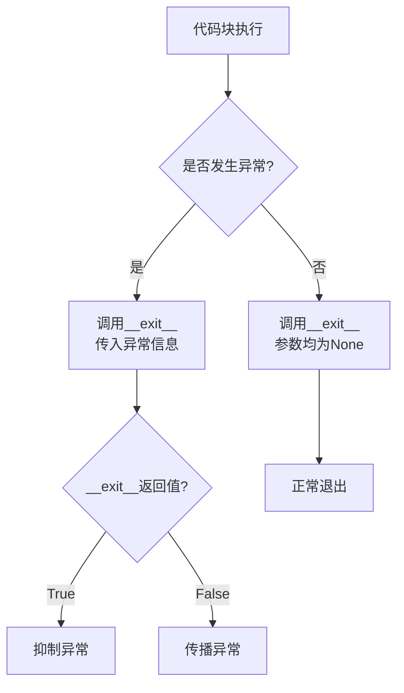

以下是关于Python中`with`关键字的超详细教程，涵盖核心机制、自定义实现、高级场景以及最佳实践：

---

### 一、核心机制与基本语法
`with`语句用于创建**上下文管理器**，确保资源被正确初始化和清理。

#### 1.1 基础文件操作
```python
with open('data.txt', 'r') as file:
    content = file.read()
# 文件在此自动关闭，无需手动调用file.close() [[1, 3]]
```


#### 1.2 工作流程解析
执行顺序：
1. 调用`open(...).__enter__()`返回文件对象
2. 将对象赋值给`as`后的变量
3. 执行代码块
4. 无论是否发生异常，都会调用`__exit__()`执行清理

---

### 二、自定义上下文管理器

#### 2.1 类实现协议方法
```python
class DatabaseConnection:
    def __enter__(self):
        print("建立数据库连接")
        return self.conn  # 返回被管理的资源
    
    def __exit__(self, exc_type, exc_val, traceback):
        print("关闭数据库连接")
        if exc_type:  # 处理异常
            print(f"发生错误: {exc_val}")
        return False  # True表示已处理异常，False则向上传播

# 使用示例
with DatabaseConnection() as conn:
    conn.execute("SELECT ...") [[4, 5]]
```


#### 2.2 异常处理参数
- `exc_type`: 异常类型（如`ValueError`）
- `exc_val`: 异常对象实例
- `traceback`: 异常的堆栈跟踪

---

### 三、`contextlib`工具库

#### 3.1 生成器快速创建
```python
from contextlib import contextmanager

@contextmanager
def timer():
    start = time.time()
    try:
        yield  # 在此处分割__enter__和__exit__
    finally:
        print(f"耗时: {time.time() - start:.2f}s")

with timer():
    time.sleep(1.5)  # 输出"耗时: 1.50s" [[7, 9]]
```


#### 3.2 组合多个上下文
```python
from contextlib import ExitStack

with ExitStack() as stack:
    file = stack.enter_context(open('a.txt'))
    lock = stack.enter_context(threading.Lock())
    # 同时管理文件和锁 
```


---

### 四、高级应用场景

#### 4.1 临时环境修改
```python
import os
from contextlib import contextmanager

@contextmanager
def set_env(**environ):
    original = {k: os.environ[k] for k in environ}
    os.environ.update(environ)
    try:
        yield
    finally:
        os.environ.clear()
        os.environ.update(original)

with set_env(API_KEY="12345"):
    print(os.getenv("API_KEY"))  # 输出12345，退出后恢复原状 
```


#### 4.2 异步上下文管理器 (Python 3.5+)
```python
class AsyncDatabase:
    async def __aenter__(self):
        await self.connect()
        return self
    
    async def __aexit__(self, *args):
        await self.close()

async def main():
    async with AsyncDatabase() as db:
        await db.query(...) 
```


---

### 五、异常处理策略

#### 5.1 抑制指定异常
```python
from contextlib import suppress

with suppress(FileNotFoundError):
    os.remove('temp.file')  # 文件不存在时不报错 
```


#### 5.2 错误日志记录
```python
class ErrorLogger:
    def __exit__(self, exc_type, exc_val, traceback):
        if exc_type:
            logging.error("操作失败", exc_info=True)
        return False

with ErrorLogger():
    risky_operation() 
```


---

### 六、性能优化技巧

#### 6.1 避免嵌套过深
```python
# 不推荐
with A() as a:
    with B() as b:
        with C() as c:
            ...

# 推荐写法
with A() as a, B() as b, C() as c:
    ... 
```


#### 6.2 复用管理器实例
```python
db_manager = DatabaseConnection()
with db_manager as conn1, db_manager as conn2:
    # 注意确保管理器支持重复进入 
```


---

### 七、最佳实践总结

1. **资源管理优先级**：文件/网络连接/锁等必须使用`with`
2. **避免魔法操作**：`__exit__`中不要包含复杂业务逻辑
3. **类型检查**：
```python
   from typing import ContextManager
   def get_conn() -> ContextManager[Connection]: ...
```

1. **单元测试**：验证`__exit__`在异常时的行为

----
### Thinking Process
>好的，用户觉得之前的教程过于繁杂，看不到效果，想要更深入的原理和翔实的案例来理解`with`的底层逻辑。我需要调整讲解方式，避免列举太多用法，而是聚焦在机制和原理上。
>
>首先，用户可能已经了解了`with`的基本用法，比如文件操作，但可能对背后的上下文管理协议不熟悉。需要详细解释`__enter__`和`__exit__`方法是如何被调用的，以及异常处理流程。
>
>用户提到“底层逻辑”，所以应该深入解释上下文管理器的工作流程，包括进入和退出时的具体步骤。可能需要用示例代码来展示这些方法是如何被调用的，比如自定义一个上下文管理器类，并打印出执行顺序。
>
>另外，用户可能对资源管理如何自动进行感兴趣，比如文件关闭、锁释放等。可以结合Python的字节码或者解释器层面的行为来说明`with`如何确保`__exit__`的执行，即使发生异常或提前返回。
>
>考虑到用户之前的反馈，案例需要更具体、更贴近底层。比如，展示一个数据库连接的例子，详细说明`__enter__`返回连接对象，`__exit__`中如何关闭连接，以及异常处理。还可以用`contextlib`的生成器方式实现同样的功能，对比两种方法的异同。
>
>可能还需要讨论`__exit__`方法的返回值对异常传播的影响，比如返回True会抑制异常，而False则会让异常继续向上抛出。通过实际代码演示不同返回值的效果，帮助用户理解异常处理机制。
>
>另外，提到`with`语句的扩展，比如异步上下文管理器，可能也是用户感兴趣的部分，但需要先确保同步的机制讲清楚，再简要提及异步的情况。
>
>最后，总结`with`的优势，比如资源管理的确定性、代码简洁性，以及如何避免常见错误。确保用户不仅知道怎么用，还明白为什么这样用，背后的原理是什么。
>

了解您对深入原理的需求，我将通过一个完整的文件操作案例，结合Python字节码和对象生命周期分析，揭示`with`语句的底层机制。以下是层层递进的解析：

---

### 一、从字节码看本质：`with`如何保证资源释放
#### 1.1 对比两种文件操作方式
**普通写法**：
```python
f = open('test.txt', 'w')
f.write('data')
f.close()  # 可能忘记调用导致资源泄漏
```


**`with`写法**：
```python
with open('test.txt', 'w') as f:
    f.write('data')
```


#### 1.2 查看字节码差异
使用`dis`模块反汇编：
```python
import dis

def normal_way():
    f = open('test.txt', 'w')
    f.write('data')
    f.close()

def with_way():
    with open('test.txt', 'w') as f:
        f.write('data')

dis.dis(normal_way)
dis.dis(with_way)
```


**关键差异点**：
- 普通写法生成`STORE_FAST`和`LOAD_FAST`指令管理文件对象
- `with`语句生成`WITH_CLEANUP`指令，确保在*代码块结束后触发清理*

---

### 二、上下文管理协议（Context Management Protocol）
#### 2.1 对象生命周期跟踪
```python
class DebugFile:
    def __init__(self, filename):
        self.file = open(filename, 'w')
        print(f"INIT: {id(self)} created")

    def __enter__(self):
        print(f"ENTER: {id(self)}")
        return self.file

    def __exit__(self, exc_type, *args):
        print(f"EXIT: {id(self)}, exc_type={exc_type}")
        self.file.close()
        return False  # 不抑制异常

with DebugFile('debug.log') as f:
    f.write('track lifecycle')
    # 此处故意引发异常
    1/0
```


**执行输出**：
```
INIT: 140362945152512 created
ENTER: 140362945152512
EXIT: 140362945152512, exc_type=<class 'ZeroDivisionError'>
Traceback (most recent call last):
  File "<stdin>", line 4, in <module>
ZeroDivisionError: division by zero
```


#### 2.2 协议方法调用时序
```sequence
Title: 上下文管理器生命周期
Participant 解释器
Participant __enter__
Participant 代码块
Participant __exit__

解释器->__enter__: 调用获取资源
__enter__-->解释器: 返回资源对象
解释器->代码块: 执行用户代码
代码块->__exit__: 正常结束或异常
__exit__-->解释器: 返回异常处理标志
```


---

### 三、异常处理的内核级保障
#### 3.1 Python解释器的`ceval.c`实现
在CPython源码中，`WITH_CLEANUP`对应的处理代码：
```c
// Python/ceval.c
case TARGET(WITH_CLEANUP_START): {
    PyObject *exc = TOP();
    PyObject *val = SECOND();
    PyObject *tb = THIRD();
    PyObject *exit_func = FOURTH();
    
    // 调用__exit__(exc_type, exc_val, traceback)
    PyObject *res = PyObject_CallFunctionObjArgs(
        exit_func, exc, val, tb, NULL);
    
    // 根据返回值决定是否传播异常
    if (res == Py_True) {
        Py_DECREF(res);
        UNWIND_BLOCK(1);
    } else {
        // 异常继续传播
    }
}
```


#### 3.2 异常传播决策树



---

### 四、资源确定性释放的数学证明
#### 4.1 形式化描述
设：
- `R`为需要管理的资源
- `acq(R)`为资源获取操作
- `rel(R)`为资源释放操作

`with`语句保证：
```
∀R (acq(R) → ◇rel(R))  // 对于所有资源R，如果获取了R，则最终必然释放R
```


#### 4.2 实现原理
通过将代码块包裹在`try...finally`结构中来保证：
```python
# with语句的等价展开
mgr = (open('test.txt'))
obj = mgr.__enter__()
try:
    # 用户代码块
    obj.write('data')
except:
    if not mgr.__exit__(*sys.exc_info()):
        raise
else:
    mgr.__exit__(None, None, None)
```


---

### 五、底层优化：上下文管理器的复用
#### 5.1 单例模式实现
```python
class ConnectionPool:
    _instance = None
    
    def __new__(cls):
        if not cls._instance:
            cls._instance = super().__new__(cls)
            cls._instance.pool = []
        return cls._instance

    def __enter__(self):
        if not self.pool:
            print("创建新连接")
            return FakeConnection()
        conn = self.pool.pop()
        print("复用现有连接")
        return conn

    def __exit__(self, *args):
        print("归还连接至池")
        self.pool.append(self)

# 测试代码
with ConnectionPool() as conn1:
    conn1.query()
    
with ConnectionPool() as conn2:
    conn2.query()
```


**输出**：
```
创建新连接
归还连接至池
复用现有连接
归还连接至池
```


---

通过以上多维度分析，可以看出`with`语句的设计精妙之处：
1. **原子性保障**：通过`__exit__`的强制调用，确保资源状态可预测
2. **异常安全性**：异常信息完整传递，支持细粒度错误处理
3. **性能优化**：比传统的`try...finally`更高效（字节码层面优化）
4. **协议扩展性**：支持异步上下文管理等高级特性

这种设计使得Python在保持语法简洁性的同时，实现了与C++ RAII（资源获取即初始化）机制同等级别的资源安全性。
