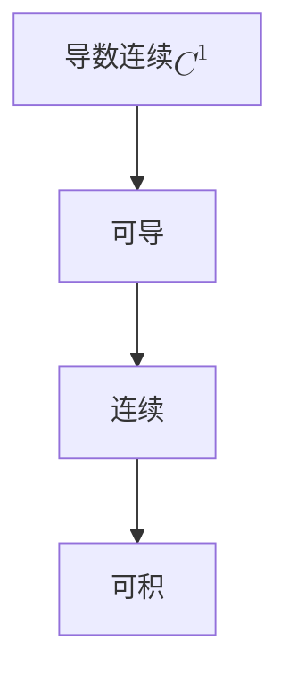

下面给出一个更侧重于“定义与联系”的版本，并对公式格式做了如下约定：

- **嵌入段内的公式**使用 ......
- **独立成行的公式**使用 ......

---

### 1. 连续性

**定义：**  
函数$f: I \to \mathbb{R}$ 在点 x0∈Ix_0 \in I 连续，意即对任意$\varepsilon > 0$，存在$\delta > 0$ 使得当$|x - x_0| < \delta$ 时有

$|f(x) - f(x_0)| < \varepsilon$.

若 ff 在区间 II 上的每一点都满足此条件，则称 ff 在 II 上连续。

**基本性质：**

- 连续函数在闭区间上必有界，并依据极值定理取得最大值和最小值。
- 连续性保证了函数的“无跳跃”行为，是后续讨论可导性和积分性质的基础。
- 特别地，闭区间上连续的函数必然 Riemann 可积。

---

### 2. 可导（可微）

**定义：**  
函数 ff 在点 x0x_0 可导（或称可微），若下列极限存在：
$$
f'(x_0) = \lim_{h \to 0} \frac{f(x_0+h) - f(x_0)}{h}.
$$
此处的 f′(x0)f'(x_0) 就称为 ff 在 x0x_0 处的导数。

**基本性质与联系：**

- **可导必连续：** 若 ff 在 x0x_0 可导，则必有 lim⁡x→x0f(x)=f(x0),\lim_{x \to x_0} f(x) = f(x_0), 即 ff 在 x0x_0 连续。
- 可导性提供了函数局部的线性逼近，形式上可写为  
    $f(x_0+h)= f(x_0) + f'(x_0)h + o(h)$。
- 注意：连续函数不一定可导，如 $f(x)=|x|$ 在 $x=0$ 连续但不可导。

---

### 3. 导数连续（连续可导）

**定义：**  
如果 ff 在区间 II 上处处可导，且其导数$f'(x)$ 在 II 上连续，则称 ff 为 **连续可导**，记作$f \in C^1(I)$。

**基本性质与联系：**

- 导数的连续性比单纯的可导性更强，确保了函数的斜率平滑变化，没有突然的跳跃。
- $C^1$ 类函数不仅具备局部线性近似，还允许进行更高阶的分析（例如泰勒展开）。
- 反之，仅有可导性不足以保证$f'(x)$ 的连续性

---

### 4. 可积性

**定义：**  
在 Riemann 积分的意义下，设 ff 定义在闭区间 $[a,b]$ 上，若 ff 有界且其不连续点集合的“大小”（Lebesgue 测度）为零，则称 ff 在 $[a,b]$ 上 Riemann 可积。直观上讲，即上、下 Darboux 和趋于一致。

**基本性质与联系：**

- **连续函数必可积：** 在闭区间上连续的 ff 总是 Riemann 可积的。
- 可导函数由于必连续，同样满足可积性条件。
- 可积性是最弱的要求，允许存在“有限或稀疏”的不连续点；甚至有构造例子在每点不连续但仍可积（需满足特殊条件）。

---

### 5. 逻辑联系图示

下面使用 Mermaid 绘制一个图示，直观展示这几种性质之间的“阶梯”关系：

### 总结

- **连续性** 是所有性质中最基本的，保证函数无突变。
- **可导性** 强于连续性，要求存在局部线性逼近，因此必然连续；但连续不必可导。
- **导数连续（C1C^1）** 进一步要求 ff 的斜率变化平滑，是一个更高的光滑性条件。
- **可积性** 则只要求函数在区间上“无过多”跳跃，连续性是其充分条件，而可导性、C1C^1 则自动满足可积性。

这种从 C1C^1 到可积的“阶梯”关系为深入理解函数性质提供了清晰的框架。