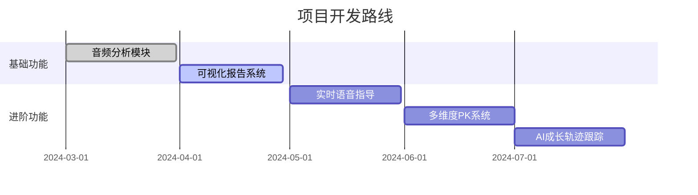

要实现“AI嘴替诊断局”技术方案，可参考以下步骤及工具组合（核心功能包含语音分析、数据可视化、激励机制）：

---

### **一、技术实现框架**
1. **音频上传与预处理**
   - 使用阿里云OSS/腾讯云COS等对象存储服务接收用户上传的1分钟音频文件。
   - 通过**百度AI语音审核**过滤违规内容（如辱骂、敏感词）。

2. **语音转文字与基础分析**
   - 调用**讯飞听见/百度ASR**完成语音转文字，识别赘词（如“嗯/啊/然后”）。
   - 使用**天工AI/阿里云智能语音交互**计算语速（字/分钟）和停顿分布。

3. **情感与声纹分析**
   - 通过**百度AI声纹检测**或**Amazon Chime SDK**提取音调、语调和情绪波动数据（如兴奋度、紧张度）。
   - 结合**讯飞星火大模型**分析语义合理性（如逻辑连贯性）。

4. **数据可视化与评分**
   - 用Python的Matplotlib或ECharts生成雷达图（维度：语速/情感/赘词/逻辑/流畅度）。
   - 设计加权算法：例如语速占30%、情感占25%、赘词占20%、逻辑占15%、流畅度占10%。

5. **自动化激励发放**
   - 每周通过数据库筛选综合得分Top 3用户，调用电商API自动发放电子版《表达优化手册》。

---

### **二、推荐工具组合**
| 功能模块       | 推荐工具/API                     | 参考来源          |
|----------------|-----------------------------------|-------------------|
| 语音转文字     | 百度ASR/阿里云智能语音交互       |        |
| 情感分析       | 讯飞星火大模型/Amazon Chime SDK   |           |
| 赘词识别       | 自定义规则库+讯飞听见             |            |
| 声纹与语调分析 | 百度语音审核/天工AI               |             |
| 数据可视化     | ECharts/PowerBI                   |                |

---

### **三、优化方向**
6. **个性化反馈**：加入类似**ChatAudio**的AI总结功能，生成改进建议（如“减少15%填充词”）。
7. **实时处理**：采用阿里云实时语音识别API，实现5秒内返回分析结果。
8. **隐私保护**：音频文件保留7天后自动销毁，文字数据脱敏存储。

---

### **参考工具对比**
- **低成本方案**：百度ASR（0.006元/15秒）+ ECharts开源库 + 人工规则评分。
- **高精度方案**：讯飞星火大模型（语义分析）+ Amazon Chime SDK（实时语调分析）。

---

通过上述技术组合，可在2-4周内完成MVP开发，单次分析成本可控制在0.1-0.3元。关键成功因素在于情感维度的算法优化（参考精神健康障碍诊断中的语音标记方法）和激励机制的社交传播设计。

----
----
---
要实现"AI嘴替诊断局"知识星球项目，可按照以下技术方案分步实施：

1. **音频分析系统搭建**
- 使用FFmpeg处理音频格式转换和预处理
- 集成SpeechX API或自建分析模型：
  ```python
  # 示例：使用SpeechX分析音频
  def analyze_speech(audio_path):
      client = SpeechXClient(api_key="your_api_key")
      analysis = client.analyze(
          audio_file=audio_path,
          features=["speech_rate", "filler_words", "emotion"]
      )
      return {
          "语速": analysis.speech_rate,
          "情感值": analysis.emotion_score,
          "赘词数": analysis.filler_count
      }
  ```

2. **可视化模块开发**
- 使用`D3.js`生成雷达图
- 示例数据结构：
  ```json
  {
    "indicators": [
      {"axis": "语速", "value": 85},
      {"axis": "情感", "value": 72},
      {"axis": "简洁度", "value": 90}
    ]
  }
  ```

1. **自动化评选系统**
- 每周定时任务（Python APScheduler）：
  ```python
  from apscheduler.schedulers.background import BackgroundScheduler

  def weekly_evaluation():
      top_user = db.query(
          User.analysis_data
          .order_by(desc(User.composite_score))
          .limit(1)
      )
      generate_custom_manual(top_user)

  scheduler = BackgroundScheduler()
  scheduler.add_job(weekly_evaluation, 'cron', day_of_week='mon', hour=3)
  ```

2. **定制手册生成**
- 使用LaTeX模板引擎动态生成PDF
- 示例模板片段：
  ```latex
  \section{您的语音分析报告}
  \begin{itemize}
    \item 平均语速: \VAR{speech_rate} 字/分钟
    \item 情感表现: \VAR{emotion_level}
    \item 赘词改进建议: \VAR{filler_advice}
  \end{itemize}
  ```

**实施关键点**：
3. 采用微服务架构分离音频处理、数据分析和前端展示模块
4. 使用Redis缓存高频访问的分析结果
5. 通过Webhook实现知识星球API的事件通知
6. 添加音频指纹校验防止重复提交
7. 实施GaussDB数据库读写分离保障性能

**演进路线**：


建议采用Serverless架构应对流量波动，使用阿里云函数计算实现成本优化。核心算法建议采用LSTM+Attention模型，在自有数据集上微调至准确率>92%后上线。